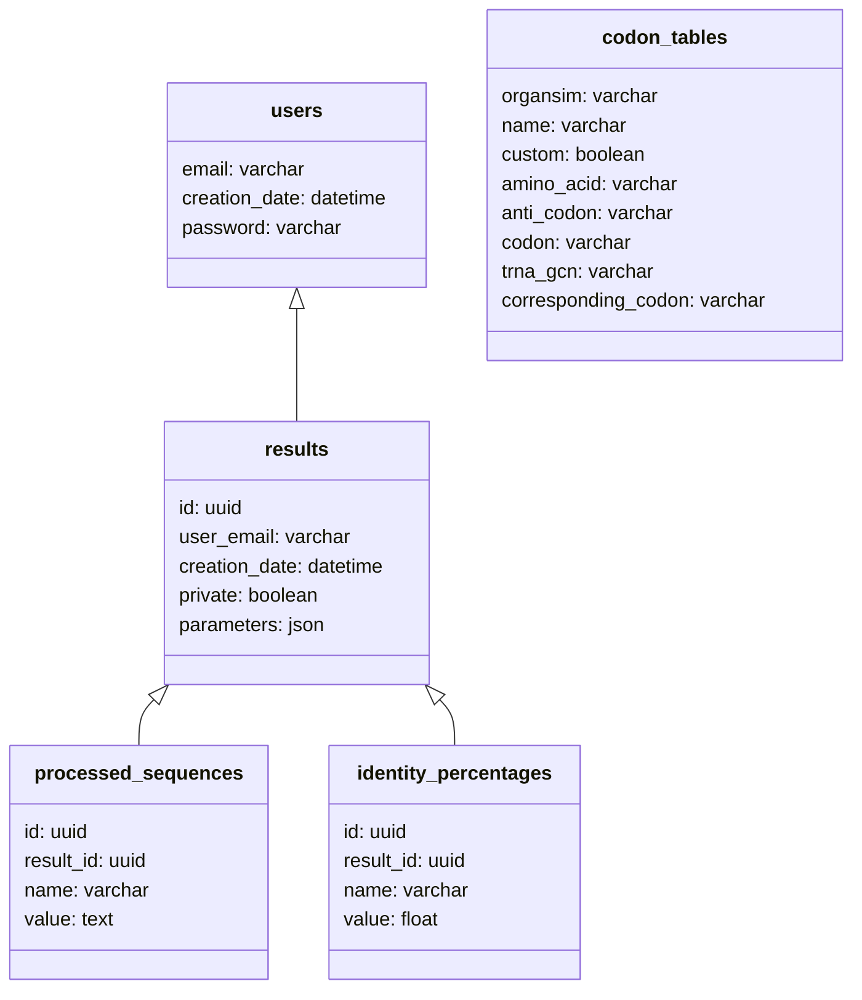

# ExpressInHost_Web

## Database schema (temporary)

```mermaid
classDiagram
    codon_tables
    users <|-- results
    results <|-- processed_sequences
    results <|-- identity_percentages

    class codon_tables {
        organsim: varchar
        name: varchar
        custom: boolean
        amino_acid: varchar
        anti_codon: varchar
        codon: varchar
        trna_gcn: varchar
        corresponding_codon: varchar
    }

    class users {
        email: varchar
        creation_date: datetime
        password: varchar
    }

    class results {
        id: uuid
        user_email: varchar
        creation_date: datetime
        private: boolean
        parameters: json
    }

    class processed_sequences {
        id: uuid
        result_id: uuid
        name: varchar
        value: text
    }

    class identity_percentages {
        id: uuid
        result_id: uuid
        name: varchar
        value: float
    }
```
