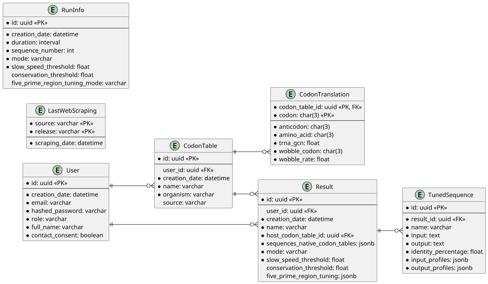
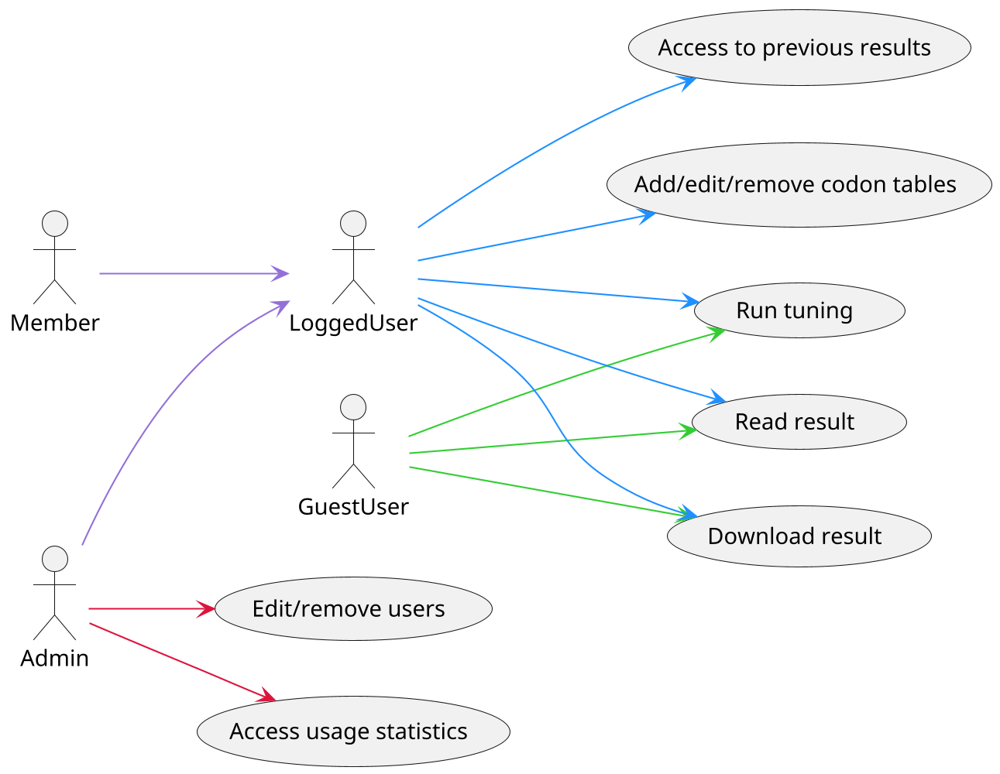

# ExpressInHost_Web

ExpressInHost is a web application for codon optimization in recombinant protein expression. It optimizes mRNA sequences to enhance protein expression while considering proper protein folding in host organisms.

It builds on our [previous work](https://openresearchsoftware.metajnl.com/articles/10.5334/jors.385) as well as on open source work from other groups for [tRNA data](https://gtrnadb.ucsc.edu/) collection and [ribosome binding](https://joss.theoj.org/papers/10.21105/joss.03362) properties.

## Main Features

- Tuning mRNA sequences based on tRNA gene copy number data
- Analyzing and comparing translation speed properties between native and host organisms
- Supporting multiple organisms with customizable options
- Optimizing mRNA structural properties for ribosome binding
- Providing a free, user-friendly interface for researchers and scientists

# Backend

## API

The backend API is built using FastAPI, a modern, high-performance web framework for building APIs based on standard Python type hints. FastAPI provides automatic OpenAPI documentation, validation, and asynchronous request handling.

## Database

The application uses PostgreSQL as its primary database.

The schema includes tables for:

- User management (users, roles)
- Codon tables and translations
- Tuning results and parameters
- Usage tracking

## Data Collection

The codon tables come from [Lowe Lab](https://lowelab.ucsc.edu/) and especially from [GtRNAdb](https://gtrnadb.ucsc.edu/). They are parsed with the [selectolax](https://github.com/rushter/selectolax) Python library, which provides efficient HTML parsing capabilities.

The application maintains up-to-date codon usage data by periodically scraping tRNA gene copy numbers and generating codon tables for thousands of organisms.

## User System and Security

### Roles:

- **Guest (non-logged):** Users who are not logged in have limited access to the application's features.
- **Member:** Registered users with standard access privileges.
- **Admin:** Users with elevated privileges, capable of managing the application and other users.

### Security:

The application uses JSON Web Tokens (JWT) for authentication:

- JWT tokens contain encoded user information and are signed to prevent tampering
- Access tokens have a limited lifetime (12 hours)
- Passwords are securely hashed using bcrypt
- Role-based access control protects sensitive endpoints

## Job Manager

The job manager uses Redis Queue (RQ) to handle asynchronous processing:

- **Multiple Queues**: Separates jobs into "light", "heavy", and "web_scraping" queues for efficient resource allocation
- **Job State Tracking**: Maintains job state (queued, started, finished, failed) and progress information
- **Streaming Progress**: Provides real-time progress updates to the frontend through streaming responses
- **Job Control**: Allows cancellation and management of running jobs
- **Error Handling**: Robust error handling for failed jobs with detailed exception information

## Tuning Modes

The application offers three distinct tuning modes:

1. **Direct Mapping**: Maps codons from native to host organism while preserving relative translation speeds.

2. **Optimization and Conservation 1**: Uses clustal alignment data to identify conserved positions. Conserved positions (marked with "\*") maintain their relative speed in the host, while non-conserved positions are fully optimized for expression.

3. **Optimization and Conservation 2**: Identifies slow codons across multiple native sequences and preserves their relative speeds if they meet a conservation threshold, while optimizing all other positions.

Additionally, there are two 5' region tuning options:

- **Partial Untuning**: Keeps the first N codons unchanged from the native sequence
- **Fine Tuning**: Uses a specialized algorithm ([OSTIR](https://github.com/barricklab/ostir)) to optimize the 5' UTR region for ribosome binding

### Tuning Process

The core tuning system involves:

1. Parsing input sequences (DNA/RNA)
2. Aligning sequences if necessary
3. Applying the selected tuning mode
4. Preserving amino acid sequences
5. Computing similarity between input and output
6. Generating speed and rank profiles

# Frontend

The frontend is built with Vue.js and includes these key components:

## Tuning Form

The tuning form provides:

- Sequence input options (paste, file upload)
- Codon table selection (host organism)
- Tuning mode selection
- Advanced parameters configuration
- Job submission and progress tracking

## Registration

The registration system includes:

- User signup with email verification
- Login with JWT authentication
- Password reset functionality
- Profile management

## Codon Table Editor

The codon table editor allows:

- Viewing built-in codon tables
- Creating custom codon tables
- Editing tRNA gene copy numbers

## History of Results

The results history features:

- List of previous tuning jobs
- Detailed view of each result
- Comparison between original and tuned sequences
- Speed and rank profile visualization with Chart.js
- Export options (FASTA, CSV)

## Administration Dashboard

The admin dashboard provides:

- User management (create, edit, delete)
- System usage statistics
- Codon table management
- Server logs

## Logo credits

The logo is made by Jagjot Arora.
